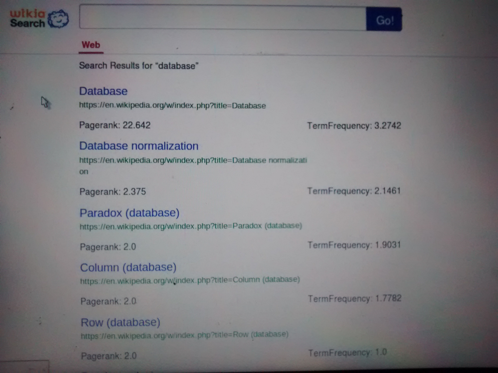
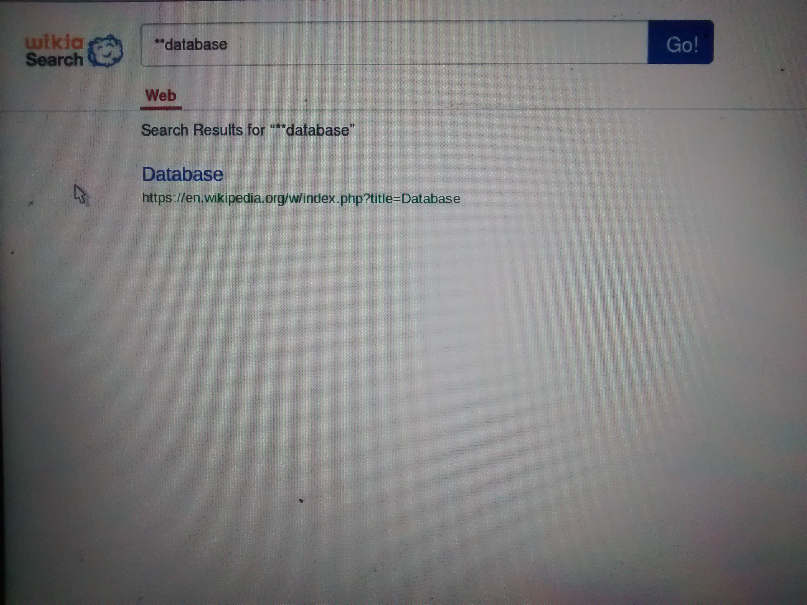

# Information Retrieval System from Wikipedia Dataset 
----------

##Features
* Information Retrieval System from Wikipedia dump, developed on top of Hadoop EcoSystem.  
* Single word query
* I'm Felling Lucky” type Functionality
* Special search feature

## Technology/Framework
* We used 
	+ JavaEE(JSP & Sevelet)
	+ Hadoop
	+ HBase(as a Datastore )
	+ Oozie (as a workflow engine)

## External Tools
	+ Tableau (Business Intelligence Tool for Visualization)
	+ Gephi(Open Source tool for Network Analysis and Visualization)
	+ StarUML (Diagram Tool)
	
## Demo
### Screenshot of Typical IR Task

### GIF of System
 

### Screenshot of System

### WorkFlow
[Oozie workflow of Map-Reduce Jobs](mrjob.png)

[Oozie workflow of Page Rank Map-reduce Jobs](PR.png)

### Page Rank Graph Visualization

* This Graph is  created using Gephi Tool.

### Tableau Visualization Links

	- [PageRank Visualization](http://public.tableau.com/profile/vimox#!/vizhome/PR_Final_0/Sheet1)
	- [TF Visualization](http://public.tableau.com/profile/vimox#!/vizhome/FII_Final/Sheet1) 
	
Team:-
- Vimox(myself)
- [Sagar Patel](http://github.com/sagarpatel26)
